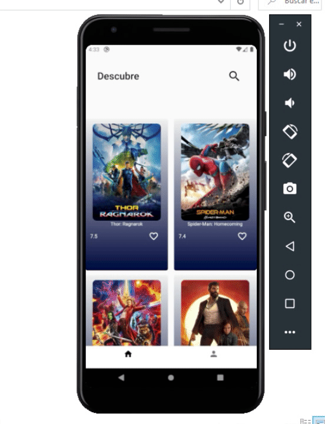
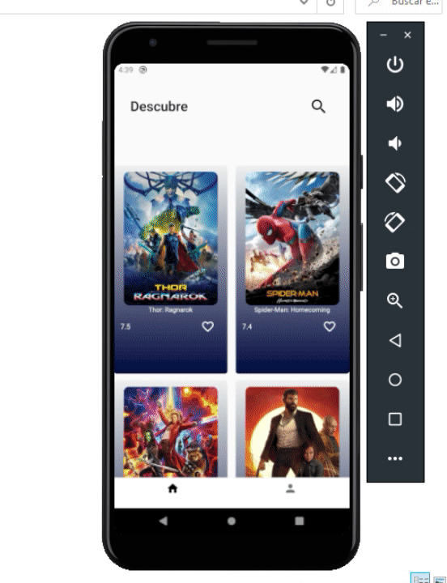
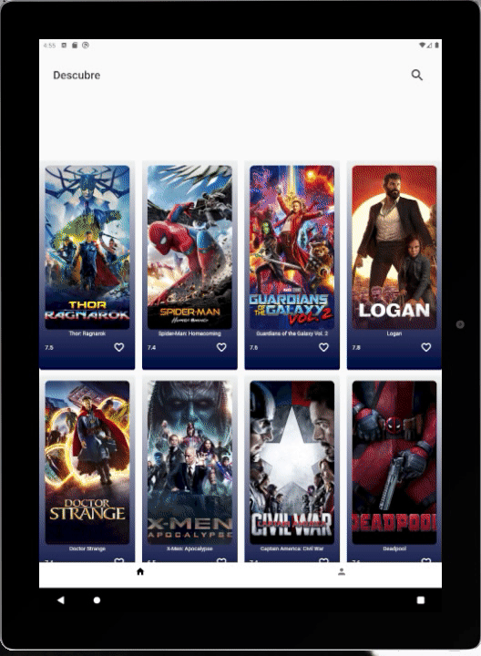
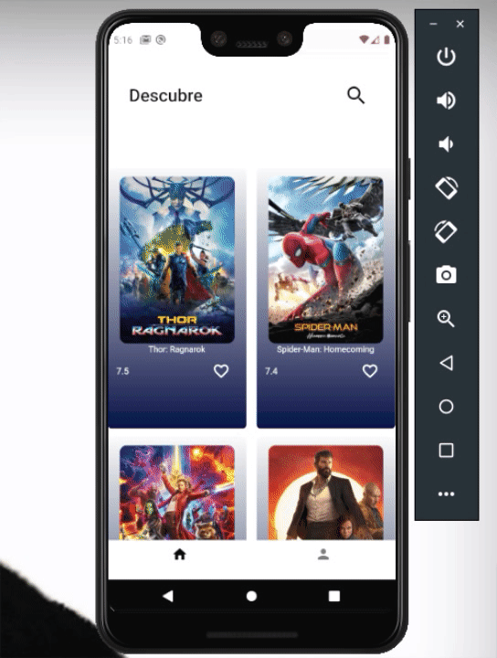

# movies

Un protecto creado con Flutter.

## Getting Started

This project is a starting point for a Flutter application.

A few resources to get you started if this is your first Flutter project:

- [Lab: Write your first Flutter app](https://flutter.dev/docs/get-started/codelab)
- [Cookbook: Useful Flutter samples](https://flutter.dev/docs/cookbook)

For help getting started with Flutter, view our
[online documentation](https://flutter.dev/docs), which offers tutorials,
samples, guidance on mobile development, and a full API reference.

## Start project

 Running: flutter packages get -v from the terminal in that folder

 Select a Device for run the project

 in the terminal in that folder of project write: flutter run  and enter

## Demo
  ### cellphone screens
 

  ### Tablet screens
  

  ### Search screen
  
 
  ### Method like
  

  ### Method watchlist
  

  ## Architectures implemented
   1. Clean Architecture
   2. BLoC Architecture

